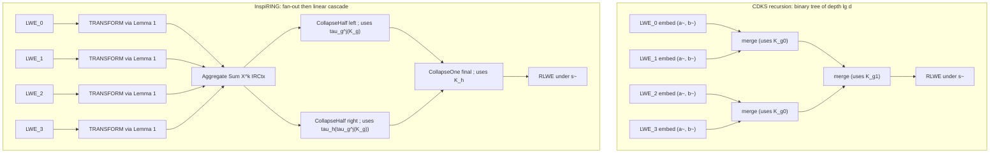

# `inspiring` — Specification of the InspiRING ring-packing algorithm

This document is the design specification and mathematical companion for the `inspiring` Rust crate, which implements **Algorithm 1 (`InspiRING.Pack`)** from the InsPIRe paper:

> R. A. Mahdavi, S. Patel, J. Y. Seo, K. Yeo. *InsPIRe: Communication-Efficient PIR with Server-side Preprocessing.* ePrint 2025/1352. <https://eprint.iacr.org/2025/1352>

The reference implementation we cross-check against is at <https://github.com/google/private-membership/tree/main/research/InsPIRe>.

This spec is **the contract** for the Rust code: every paper symbol used in the implementation is defined here, every step that ends up in code is justified here, and every test in `tests/` derives its assertions from one of the lemmas or theorems below.

The scope of this crate is intentionally narrow:

- **Algorithm 1 only** — full `d → 1` packing of `d` LWE ciphertexts (each of LWE dim `d`) into a single RLWE ciphertext of degree `d`, using exactly two key-switching matrices.
- No `PartialPack` (Algorithm 2), no PIR layers (`InsPIRe`, `InsPIRe^(2)`, `InsPIRe_0`), no homomorphic polynomial evaluation.

---

## Table of contents

1. [Notational conventions](#1-notational-conventions)
2. [The cyclotomic ring and its Galois group](#2-the-cyclotomic-ring-and-its-galois-group)
3. [Lemma 1: the trace operator](#3-lemma-1-the-trace-operator)
4. [Stage 1: LWE → intermediate (`TRANSFORM`)](#4-stage-1-lwe--intermediate-transform)
5. [Stage 2: aggregation](#5-stage-2-aggregation)
6. [Stage 3: collapse to RLWE](#6-stage-3-collapse-to-rlwe)
7. [Noise growth (Theorem 2)](#7-noise-growth-theorem-2)
8. [The offline / online split (CRS model)](#8-the-offline--online-split-crs-model)
9. [Comparison with CDKS [18]](#9-comparison-with-cdks-18)
10. [Symbol table (paper ↔ code)](#10-symbol-table-paper--code)
11. [Spec acceptance checklist](#11-spec-acceptance-checklist)

---

## 1. Notational conventions

We follow the paper's notation, with one simplification: throughout this spec we **fold the LWE noise and message into a single "message" symbol** during structural derivations, exactly as the paper does in §3:

> the LWE pseudorandom component `b = -⟨a, s⟩ + e + Δ·m` will be written as `b = -⟨a, s⟩ + m'` where `m' = e + Δ·m`. […] this notational convenience does not impact the correctness or security of the described algorithm.

Noise reappears explicitly in [§7](#7-noise-growth-theorem-2).

| Symbol | Meaning |
|---|---|
| `d` | A power of two. Both the LWE dimension and the RLWE ring degree. |
| `q` | A modulus, **odd** (so that `d^{-1} mod q` exists). |
| `p` | The plaintext modulus; messages live in `Z_p`. |
| `Δ = ⌊q / p⌋` | Scaling factor for the standard "bit-fixing" embedding. |
| `R = Z[X]/(X^d + 1)` | The cyclotomic ring. |
| `R_q = Z_q[X]/(X^d + 1)` | The cyclotomic ring modulo `q`. |
| `χ` | A subgaussian error distribution with parameter `σ_χ`. |
| `s ∈ Z^d` | An LWE secret key. |
| `s̃ ∈ R_q` | The polynomial interpretation of `s`: `s̃ = Σ_{i=0}^{d-1} s[i] · X^i`. |
| `(a, b) ∈ Z_q^d × Z_q` | An LWE ciphertext: `b = -⟨a, s⟩ + e + Δ·m`. |
| `(c_1, c_2) ∈ R_q × R_q` | An RLWE ciphertext: `c_2 = -c_1·s̃ + e + Δ·m̄`. |
| `g_z`, `g_z^{-1}` | Gadget vector / decomposition operator (paper §2 and `[64]`). For modulus `q` and base `z`, `g_z = [1, z, z^2, …, z^{ℓ-1}]^⊤ ∈ Z_q^ℓ` with `ℓ = ⌈log q / log z⌉`; `g_z^{-1}: Z_q → Z^{1×ℓ}` returns digit decomposition with each digit in `[-z/2, z/2)`, extended coefficient-wise to `R_q`. |
| `τ_g` | A Galois automorphism of `R`, defined by `τ_g(p)(X) = p(X^g)` for `g ∈ Z*_{2d}`. |

Bold lower-case = vectors; bold upper-case = matrices; `a[i]` indexes a vector; `a[i:j]` is a slice over `[i, j)`.

When we say "`â` is in NTT form", we mean each ring element of the vector `â ∈ R_q^d` is stored as its evaluation vector under the negacyclic NTT (since `X^d + 1` splits over `Z_q`). This is just an internal representation choice for the Rust code.

---

## 2. The cyclotomic ring and its Galois group

### Ring

`R = Z[X]/(X^d + 1)` for `d = 2^n`, a power of two. Elements are written `p(X) = Σ_{i=0}^{d-1} c_i X^i` with `c_i ∈ Z`. Addition is coefficient-wise, multiplication is the standard polynomial product reduced mod `X^d + 1` (negacyclic: `X^d ≡ -1`).

### Galois group

The Galois group of `R` (equivalently, of the `2d`-th cyclotomic field's ring of integers) is

```
Gal(R) ≅ (Z / 2dZ)*
```

acting on `R` by `τ_g(p)(X) := p(X^g)` for `g ∈ Z*_{2d}`. Since `d` is a power of two, `|Z*_{2d}| = φ(2d) = d`, so the Galois group has order `d`.

### Structure as a direct product

`Z*_{2d}` decomposes as

```
Z*_{2d} ≅ Z_{d/2} × Z_2
```

(see e.g. Dummit–Foote `[34]`). We use the following two specific generators:

- **`g = 5`** generates the `Z_{d/2}` factor (order `d/2`).
- **`h = 2d − 1`** generates the `Z_2` factor (order 2).

Note `h ≡ -1 mod 2d`, so `τ_h(p)(X) = p(X^{-1}) = p(X^{2d-1})`.

The choice `g = 5` is justified by **Lemma 3 (paper Appendix D)**:

> **Lemma 3.** Let `d` be a power of two and `γ < d` also a power of two. Let `g = 2d/γ + 1 ∈ Z*_{2d}`. Then `ord(g) = γ`.

Setting `γ = d/2` yields `g = 2d/(d/2) + 1 = 5`, with order `d/2`. **Proof of Lemma 3** is by induction: `g ≡ 1 mod (g − 1)`, so all powers of `g` lie in the residue class `1 mod (2d/γ)`; combined with the pigeonhole over `γ` distinct residues `{1, 1+(2d/γ), 1+2·(2d/γ), …}`, we get `ord(g) = γ`.

### Two automorphisms we use everywhere

```
τ_g  : p(X) ↦ p(X^5)         (order d/2)
τ_h  : p(X) ↦ p(X^{2d-1}) = p(X^{-1})  (order 2)
```

Together they generate the full Galois group. Their composition `τ_h ∘ τ_g^j` for `j ∈ [0, d/2)` enumerates the `d/2` elements of the "second half" of `Gal(R)`; the elements `τ_g^j` for `j ∈ [0, d/2)` enumerate the "first half".

In code (`src/automorph.rs`) these become:

```rust
pub const G: u64 = 5;
pub const fn h(d: usize) -> u64 { (2 * d as u64) - 1 }

pub fn tau_g_pow_j(j: usize, d: usize) -> u64 {
    // Returns g^j mod 2d
    pow_mod(G, j as u64, 2 * d as u64)
}
```

These are public, fixed for the lifetime of an `RlweParams`, and cached.

---

## 3. Lemma 1: the trace operator

### Statement

> **Lemma 1.** Let `p(X) = Σ_{i=0}^{d-1} c_i X^i ∈ Z[X]/(X^d + 1)` where `d` is a power of two. Let `g = 5` and `h = 2d − 1`, and define `Tr : R → R` by
>
> ```
> Tr(p) := Σ_{j=0}^{d/2 - 1} τ_g^j(p) + τ_h ∘ τ_g^j(p).
> ```
>
> Then `Tr(p) = d · c_0`.

This is the heart of the algorithm: it gives a way to **isolate the constant coefficient** of any polynomial as a sum of `d` automorphic images. Since the Galois group is generated by `(τ_g, τ_h)`, this is just the trace of the field extension applied coefficient-wise.

### Proof (paper Appendix D)

The proof rests on two helper lemmas.

#### Lemma 4

> **Lemma 4.** Let `d` be a power of two and `γ < d` also a power of two. Let `g = 2d/γ + 1 ∈ Z*_{2d}`. Then the map `g^i mod 2d ↦ g^i + g − 1 mod 2d` is a bijection.

**Proof.** By Lemma 3, `ord(g) = γ`, and `g^i ≡ 1 mod (g − 1)` (proved by induction on `i` using `g·1 = g ≡ 1 + (g−1)`). So `{g^i mod 2d : 0 ≤ i < γ}` is exactly `{1 + j·(2d/γ) : 0 ≤ j < γ}`. Adding `g − 1 = 2d/γ` to each element shifts the index `j` by 1 mod `γ`, which is a bijection on the same set. ∎

#### Lemma 5 (the "half-trace")

> **Lemma 5.** Let `p(X) = Σ_{j=0}^{d-1} c_j X^j`. Let `γ < d` be a power of two and `g = 2d/γ + 1`. Then
>
> ```
> π_γ(p) := Σ_{i=0}^{γ - 1} τ_g^i(p) = γ · Σ_{γ | j} c_j X^j.
> ```

**Proof.** Compute

```
π_γ(p) = Σ_{i=0}^{γ-1} Σ_{j=0}^{d-1} c_j · X^{j·g^i}
       = Σ_j c_j · (Σ_{i=0}^{γ-1} X^{j·g^i}).
```

Two cases on the inner sum:

- **`γ | j`.** Then `j·(g − 1) = j · 2d/γ` is a multiple of `2d`, so `X^{j·g} = X^j` (in `R`, where `X^{2d} = 1` by `X^d = −1`). By induction `X^{j·g^i} = X^j` for all `i`, so the inner sum is `γ · X^j`.
- **`γ ∤ j`.** Set `ω := X^{j·(g − 1)}`. Then
  ```
  ω · Σ_{i=0}^{γ-1} X^{j·g^i} = Σ_{i=0}^{γ-1} X^{j·(g^i + g − 1)} = Σ_{i=0}^{γ-1} X^{j·g^i}
  ```
  by Lemma 4 (the exponents are the same set, just permuted). So `(ω − 1) · Σ = 0`. Since `R` is an integral domain and `ω ≠ 1` (which would require `2d | j·(g−1) = j·2d/γ`, i.e. `γ | j`, contradiction), we conclude `Σ = 0`. ∎

#### Proof of Lemma 1

Apply Lemma 5 with `γ = d/2`, `g = 5`:

```
π_{d/2}(p) = (d/2) · (c_0 + c_{d/2} · X^{d/2}).
```

Now apply `τ_h` to `X^{d/2}`. We have `(d/2)·(2d−1) = d·(d−1) − d/2 = d^2 − 3d/2`. Reducing modulo `2d`: `d^2 mod 2d = 0` (since `d^2 = d·d` and `d` is even, so `d^2 = (d/2)·2d`), so `(d/2)·(2d−1) ≡ −3d/2 ≡ 2d − 3d/2 = d/2 mod 2d` … wait, let me redo this.

Actually `(d/2)(2d−1) = d^2 − d/2`. Mod `2d`: `d^2 = (d/2)·(2d)`, so `d^2 ≡ 0 mod 2d`. Thus `(d/2)(2d−1) ≡ −d/2 mod 2d`, and `X^{−d/2} = X^{2d − d/2} = X^{3d/2} = X^d · X^{d/2} = −X^{d/2}` (using `X^d = −1`). So `τ_h(X^{d/2}) = −X^{d/2}`.

Therefore

```
τ_h ∘ π_{d/2}(p) = (d/2) · (c_0 − c_{d/2} · X^{d/2}).
```

Adding,

```
Tr(p) = π_{d/2}(p) + τ_h ∘ π_{d/2}(p) = d · c_0. ∎
```

### Why we care

This is the operator that lets Stage 1 isolate the LWE message as a constant polynomial. Concretely, applying `Tr` to both sides of the LWE-as-RLWE embedding (Equation 1 of the paper) and dividing by `d` (using `q` odd so `d^{-1} mod q` exists) zeroes out the `d − 1` "junk" coefficients of the embedded message and leaves only the LWE message in the constant slot.

The CDKS algorithm `[18]` (paper §3.1) is structurally **the alternative**: it never forms `Tr` upfront; instead it incrementally cancels junk coefficients level-by-level in a binary tree of merges. See [§9](#9-comparison-with-cdks-18) for the full comparison.

---

## 4. Stage 1: LWE → intermediate (`TRANSFORM`)

### Goal

Given an LWE ciphertext `(a, b) ∈ Z_q^d × Z_q` with `b = −⟨a, s⟩ + m'` (where `m' = e + Δ·m`), produce an **intermediate ciphertext**

```
IRCtx(m̂) = (â, b̃) ∈ R_q^d × R_q
```

such that `b̃ = −⟨â, ŝ⟩ + m̂ mod q`, where:

- `m̂ ∈ R_q` is a constant polynomial equal to `m'`. (The LWE message lives in slot 0; all other coefficients are 0.)
- `â ∈ R_q^d` is a vector of `d` ring elements (the new "wider" random component).
- `ŝ ∈ R_q^d` is the corresponding "wider" secret key, structured as a vector of automorphic images of `s̃`.

### Construction

#### Standard LWE-to-RLWE embedding (paper Eq. 1, identical to CDKS)

Define

```
ã  := Σ_{i=0}^{d-1} a[i] · X^{−i}     ∈ R_q
s̃  := Σ_{i=0}^{d-1} s[i] · X^{i}      ∈ R_q
b̃  := b · X^0                          ∈ R_q (constant polynomial)
```

The negative exponent on `ã` is what makes `(ã · s̃)|_{X^0} = ⟨a, s⟩` (the constant coefficient of the product equals the LWE inner product). Then over `R_q`,

```
b̃ = −ã·s̃ + m̃
```

where `m̃ ∈ R_q` is the unique element that makes the equation hold; its constant coefficient is `m'`, and its other `d − 1` coefficients are arbitrary garbage from the embedding (they encode no useful information).

#### Apply the trace and divide by `d` (paper Appendix B)

Lift to `Z[X]/(X^d + 1)`: there exists `ũ ∈ Z[X]/(X^d + 1)` with `b̃ = −ã·s̃ + m̃ + q·ũ`. Apply `Tr` to both sides:

```
Tr(b̃) = −Tr(ã·s̃) + Tr(m̃) + q · Tr(ũ).
```

Since `b̃` is a constant polynomial, `Tr(b̃) = d · b`. By Lemma 1, `Tr(m̃) = d · m'`. Reduce mod `q` (the `q · Tr(ũ)` term vanishes):

```
d · b = −Tr(ã·s̃) + d · m' (mod q).
```

Since `q` is odd, `d^{-1} mod q` exists, so

```
b̃ = b · X^0 = -d^{-1} · Tr(ã·s̃) + m̂ (mod q),    where m̂ := d^{-1} · Tr(m̃) = m' · X^0.
```

#### Expand the trace as an inner product

Using that `τ` is a ring homomorphism (it commutes with multiplication and addition):

```
Tr(ã·s̃) = Σ_{j=0}^{d/2 - 1} [τ_g^j(ã) · τ_g^j(s̃) + τ_h(τ_g^j(ã)) · τ_h(τ_g^j(s̃))].
```

So

```
b̃ = −Σ_{j=0}^{d/2-1} [d^{-1}·τ_g^j(ã)] · τ_g^j(s̃)
    −Σ_{j=0}^{d/2-1} [d^{-1}·τ_h(τ_g^j(ã))] · τ_h(τ_g^j(s̃))
    + m̂  (mod q).
```

This is exactly an inner product `−⟨â, ŝ⟩ + m̂` if we define

| index `k` | `â[k]` | `ŝ[k]` |
|---|---|---|
| `k = j ∈ [0, d/2)` | `d^{-1} · τ_g^j(ã)` | `τ_g^j(s̃)` |
| `k = j + d/2 ∈ [d/2, d)` | `d^{-1} · τ_h(τ_g^j(ã))` | `τ_h(τ_g^j(s̃))` |

That is: **the second half of `â` is the `τ_h`-image of the first half**, and likewise for `ŝ`. This correlated structure is what makes Stage 3 work with only one base key-switching matrix `K_g`.

#### Pseudocode (paper Algorithm 1, `TRANSFORM`)

```
TRANSFORM((a, b)) -> (â, b̃):
  ã  ← Σ_{i=0}^{d-1} a[i] · X^{-i}     # in R_q
  b̃  ← b · X^0
  for j ∈ [0, d/2):
      â[j]       ← d^{-1} · τ_g^j(ã)
      â[j + d/2] ← d^{-1} · τ_h(τ_g^j(ã))
  return (â, b̃)
```

### Properties we will rely on

1. **Correctness:** `b̃ = −⟨â, ŝ⟩ + m̂ mod q`, with `m̂` constant and equal to `m'`. *(Tested by `transform_correctness.rs`.)*
2. **`â` depends only on `a`** (not on `b`). So in the CRS model `â` is fully preprocessable. *(Driving constraint of the offline/online API split.)*
3. **No new noise.** Stage 1 is a deterministic algebraic re-interpretation; the noise term inside `m'` is unchanged.
4. **Homomorphic compatibility:** `IRCtx` supports component-wise addition (gives an `IRCtx` of the sum of messages) and plaintext absorption (multiplying both `â` and `b̃` by some `r ∈ R_q` gives an `IRCtx` of `r · m̂`). This is what Stage 2 uses.

---

## 5. Stage 2: aggregation

### Goal

Given `d` LWE ciphertexts `(a_0, b_0), …, (a_{d-1}, b_{d-1})` encrypting messages `m_0, …, m_{d-1}`, produce a **single** `IRCtx` whose message polynomial is `Σ_{k=0}^{d-1} m_k · X^k`.

### Construction

Apply Stage 1 to each input to get `IRCtx(m̂_k) = (â_k, b̃_k)` where `m̂_k = m_k · X^0`. Then form

```
(â_agg, b̃_agg) := Σ_{k=0}^{d-1} IRCtx(m̂_k) · X^k
                 = (Σ_k â_k · X^k,  Σ_k b̃_k · X^k).
```

By the homomorphic properties of `IRCtx`:

```
b̃_agg = −⟨â_agg, ŝ⟩ + m̂_agg (mod q),
m̂_agg = Σ_{k=0}^{d-1} m̂_k · X^k = Σ_{k=0}^{d-1} m_k · X^k.
```

Here `m̂_agg` is a degree-`(d − 1)` polynomial whose `k`-th coefficient is the `k`-th LWE message, which is exactly the desired packing.

A minor algebraic simplification: since each `b̃_k = b_k · X^0` is a constant polynomial,

```
b̃_agg = Σ_k b_k · X^k.
```

So `b̃_agg`'s coefficients are *literally the d scalar `b_k` values*. This is the only piece of Stage 2 that touches per-query data.

### Properties

1. **Correctness:** `b̃_agg = −⟨â_agg, ŝ⟩ + Σ m_k X^k mod q`. *(Tested by `aggregate_correctness.rs`.)*
2. **`â_agg` is fully preprocessable** (depends only on the `a_k`'s). The crate caches it once in `PackPreprocessed`.
3. **`b̃_agg` is online-only** but trivial to assemble (`O(d)` integer copies — no multiplication).
4. **No new noise** — addition is noise-free for our purposes (the noise inside each `m̂_k` accumulates linearly, which is fine since each `m_k = e_k + Δ·m_k` already has its own noise from the LWE source).

---

## 6. Stage 3: collapse to RLWE

### Goal

Given `IRCtx(m̂_agg) = (â_agg, b̃_agg) ∈ R_q^d × R_q`, encrypted under the `d`-vector `ŝ` from Stage 1, produce an honest two-element RLWE ciphertext `(a_fin, b_fin) ∈ R_q × R_q` encrypted under the **base** secret `s̃`, encrypting the same message `m̂_agg` (plus accumulated key-switching noise).

### Strategy: telescoping key-switches against `K_g` and `K_h`

Two key-switching matrices are generated up-front (outside this algorithm — they're inputs):

```
K_g := KS.Setup(τ_g(s̃), s̃)    # switches τ_g(s̃) → s̃
K_h := KS.Setup(τ_h(s̃), s̃)    # switches τ_h(s̃) → s̃
```

**Critical observation.** Applying an automorphism `ρ` entry-wise to `K_g = [w_g, y_g]` yields a new key-switching matrix:

```
ρ(K_g) = [ρ(w_g), ρ(y_g)],   y_g = -s̃·w_g + τ_g(s̃)·g_z + e
                       ρ(y_g) = -ρ(s̃)·ρ(w_g) + ρ(τ_g(s̃))·g_z + ρ(e).
```

So `ρ(K_g)` switches `ρ(τ_g(s̃)) → ρ(s̃)` (with noise that is a `ρ`-image of the original — same subgaussian parameter, since `ρ` permutes coefficients).

Setting `ρ = τ_g^{k-1}` we get a key-switching matrix from `τ_g^k(s̃) → τ_g^{k-1}(s̃)`. Setting `ρ = τ_h ∘ τ_g^{k-1}` we get one from `τ_h(τ_g^k(s̃)) → τ_h(τ_g^{k-1}(s̃))`.

In other words, **every key-switching matrix the algorithm needs is an automorphic image of either `K_g` or `K_h`**, computed locally with no extra ciphertext material. Hence the entire collapse runs on **two base key-switching matrices**.

### Subroutine 1: `CollapseOne`

Reduces a multi-secret ciphertext by one component.

```
COLLAPSEONE((a, b) ∈ R_q^k × R_q,  K = [w, y] ∈ R_q^{ℓ × 2}) -> (a', b') ∈ R_q^{k-1} × R_q:
  # K switches the secret share s'[k-1] of (a, b) into the share s'[k-2].
  (Δa, Δb) ← KS.Switch((a[k-1], b), K)
  # Reduce: drop the (k-1)-th component, and absorb Δa into a[k-2].
  a' ← (a[0], a[1], …, a[k-3], a[k-2] + Δa)
  b' ← Δb         # KS.Switch returned (Δa, Δb) where Δb already includes b
  return (a', b')
```

(Where `KS.Switch((a, b), K)` is the standard RLWE key-switch as defined in paper §2: `(a', b') ← (0, b) + g_z^{-1}(a) · K`.)

After this call, the ciphertext is encrypted under the secret-key vector `(s'[0], …, s'[k-2])` — the `(k-1)`-th share has been folded into the `(k-2)`-th share's slot. New noise added: a single key-switching's worth (analyzed in §7).

### Subroutine 2: `CollapseHalf`

Iteratively `CollapseOne`-s an entire half (length `d/2`) down to a single component.

```
COLLAPSEHALF((â_half, b_half) ∈ R_q^{d/2} × R_q,
             K_g = [w_g, y_g] ∈ R_q^{ℓ × 2},
             ρ ∈ {identity, τ_h}) -> (a, b) ∈ R_q × R_q:
  Rename (â_half, b_half) as (a^{(d/2 - 1)}, b^{(d/2 - 1)})
  for k = d/2 - 1, d/2 - 2, …, 1:
      K_g^{(k-1)} ← ρ(τ_g^{k-1}(K_g))
      (a^{(k-1)}, b^{(k-1)}) ← COLLAPSEONE((a^{(k)}, b^{(k)}), K_g^{(k-1)})
  return (a^{(0)}, b^{(0)})
```

For the **left half** of `â_agg` (slots `0…d/2 − 1`, masked by `ŝ[j] = τ_g^j(s̃)`), we call this with `ρ = identity`. After `d/2 − 1` `CollapseOne` calls, the result is encrypted under `s̃ = τ_g^0(s̃)` alone.

For the **right half** (slots `d/2…d − 1`, masked by `ŝ[j+d/2] = τ_h(τ_g^j(s̃))`), we call it with `ρ = τ_h`. After `d/2 − 1` calls, the result is encrypted under `τ_h(s̃)` alone.

**Why `ρ` is the right choice here:** for the right half, slot `k` is masked by `τ_h(τ_g^k(s̃))`; we need a key-switching matrix from `τ_h(τ_g^k(s̃)) → τ_h(τ_g^{k-1}(s̃))`, which is exactly `τ_h(τ_g^{k-1}(K_g)) = ρ(τ_g^{k-1}(K_g))` with `ρ = τ_h`.

### Subroutine 3: `Collapse` (top-level)

Combines both halves and folds the `τ_h(s̃)` share into `s̃` with the final `K_h` switch.

```
COLLAPSE((â_agg, b̃_agg), K_g, K_h) -> (a_fin, b_fin):
  â_left  ← â_agg[0 : d/2]
  â_right ← â_agg[d/2 : d]
  (a_1, b_1) ← COLLAPSEHALF((â_left,  b̃_agg), K_g, identity)   # encrypted under s̃
  (a_2, b_2) ← COLLAPSEHALF((â_right, b_1   ), K_g, τ_h)        # encrypted under {s̃, τ_h(s̃)}
  # At this point: b_2 = -a_1·s̃ - a_2·τ_h(s̃) + m̂_agg + e_total.
  (a_fin, b_fin) ← COLLAPSEONE(([a_1, a_2], b_2), K_h)
  return (a_fin, b_fin)
```

**Subtle but important:** the second `COLLAPSEHALF` is invoked with `b_1` (the output `b` from the first half) as its `b`. This is correct because the message and accumulated noise are all carried in the `b` component; the second half only contributes additional `−⟨â_right, ŝ_right⟩` masking which the second half's collapse undoes.

(This corresponds to what the paper's pseudocode notates as `H_1 := H_1 | b'_1` — concatenating, then collapsing — but the mathematically clean formulation is: chain the `b`s, collapse halves independently, then fold with `K_h`.)

### Total `KS.Switch` invocations

- Left half: `d/2 − 1`
- Right half: `d/2 − 1`
- Final `K_h` step: `1`
- **Total:** `d − 1`.

**This count is a structural invariant.** A correct InspiRING implementation runs exactly `d − 1` `KS.Switch` calls per `pack`. The CDKS-style alternative (paper §3.1) runs `lg d` calls per ciphertext-pair across `d − 1` merges, totalling `(d − 1) · lg d` — and uses `lg d` distinct key-switching matrices. The difference is the central design distinction of InspiRING and is asserted at runtime by `tests/inspiring_vs_cdks_recursion.rs` (Phase 9, test 10).

### Properties

1. **Correctness:** `b_fin = −a_fin·s̃ + m̂_agg + e_total mod q`. *(Tested by `collapse_correctness.rs`.)*
2. **Random-component invariant** (paper §3.2): throughout the iteration, the running `a^{(k)}` depends only on `(â_agg, K_g, K_h)` — never on `b̃_agg`. So in `PackPreprocessed::build` we precompute the entire `a`-trace of the `d − 1` collapse steps. The online phase reuses these cached `a`-vectors and only updates `b`.
3. **Noise:** see [§7](#7-noise-growth-theorem-2).

---

## 7. Noise growth (Theorem 2)

### Statement

> **Theorem 2.** Let the error distribution `χ` be subgaussian with parameter `σ_χ`. Let `ℓ` be the dimension of the key-switching matrix and `z` be the decomposition base. Under the independence heuristic, `InspiRING` incurs an additive noise `e_pack ∈ R_q`, which has subgaussian coefficients with parameter `σ_pack` and
>
> ```
> σ_pack² ≤ ℓ · d² · z² · σ_χ² / 4.
> ```

### Where the noise comes from

Stages 1 and 2 add **no** new noise — they're algebraic rearrangements. All noise comes from the `d − 1` `KS.Switch` calls in Stage 3.

#### Per-`KS.Switch` noise

`KS.Switch((a, b), K)` adds noise

```
e_ks = g_z^{-1}(a) · e   ∈ R_q
```

where `e ∈ χ(R_q^ℓ)` is the noise vector inside `K`. (See paper §2 for the standard derivation; the cancellation is `g_z^{-1}(a) · g_z = a`, so the message is preserved and only the noise term `g_z^{-1}(a)·e` survives.)

By Lemma 6 of the paper (polynomial-with-subgaussian-coeffs times bounded polynomial):

- Each entry `e[i]` has subgaussian coefficients with parameter `σ_χ`.
- Each digit `g_z^{-1}(a)[i]` has `‖·‖_∞ ≤ z/2`.
- So each product `g_z^{-1}(a)[i] · e[i]` has subgaussian coefficients with parameter `√d · (z/2) · σ_χ`.

Summing `ℓ` such independent products, the variance of each coefficient of `e_ks` is bounded by

```
σ_one_ks² ≤ ℓ · d · z² · σ_χ² / 4.
```

#### Total over the collapse

Each `KS.Switch` invocation is independent (uses an independent key-switching matrix — even the automorphic images of `K_g` use independent fresh noise inside `K_g`'s construction; we are not reusing the same noise vector). Under the independence heuristic, variances add. With at most `d − 1 ≤ d` calls,

```
σ_pack² ≤ d · σ_one_ks² ≤ ℓ · d² · z² · σ_χ² / 4. ∎
```

### Empirical sanity check

The paper measures `log₂ ‖e_pack‖_∞ = 33.4` at `d = 2048` (paper §7.4). Our `tests/noise_theorem2.rs` samples ≥ 1000 packs and asserts the empirical subgaussian parameter is below the theoretical bound (within 5% slack to account for finite-sample variance). `tests/inspiring_vs_cdks_recursion.rs` additionally asserts `log₂ ‖e_pack‖_∞ < 36` at `d = 2048`, which is well below CDKS's measured `38.5` and well above our expected `33.4` — the gap exists specifically to catch a regression where someone accidentally reintroduces CDKS-style nested noise amplification.

---

## 8. The offline / online split (CRS model)

The paper §2.2 defines the CRS model as one in which "the random components of the ciphertexts are fixed" so that "the message-independent components of the ciphertexts are fixed before the online phase, enabling precomputation". The crate's API is shaped by this split.

### What is "preprocessable"?

A quantity is preprocessable if it depends only on the **CRS**:

- The matrix `A ∈ Z_q^{d × d}` (the random parts of the `d` input LWE ciphertexts).
- The two key-switching matrices `K_g`, `K_h` (and therefore all their automorphic images).

A quantity is **online-only** if it depends on the per-query LWE pseudorandom values `b = (b_0, …, b_{d-1}) ∈ Z_q^d`.

### Mapping per stage

| Stage | Preprocessable | Online-only |
|---|---|---|
| Stage 1 (`TRANSFORM`) | All `â_k` for `k = 0…d−1`. | The trivial reinterpretation `b̃_k = b_k · X^0` (no work). |
| Stage 2 (aggregation) | `â_agg = Σ â_k · X^k`. | `b̃_agg = Σ b_k · X^k` (`O(d)` integer copies — coefficient assembly only). |
| Stage 3 (collapse) | The full `a`-trace `a^{(d/2-1)}, …, a^{(0)}` for both halves, plus the final `[a_1, a_2]` and `a_fin`. (Paper §3.2's "random-component invariant".) The implementation materialises the NTT-form gadget digits derived from that trace, one block per `CollapseOne` step. Also: all automorphic images `τ_g^{k-1}(K_g)`, `τ_h(τ_g^{k-1}(K_g))`. | The `b`-trace updates, which are `g_z^{-1}(a^{(k)}[k-1]) · y` (where `y` is the appropriate column of the precomputed KS matrix image). |

### Resulting API shape (`src/preprocess.rs`, `src/pack.rs`)

```rust
pub struct PackPreprocessed {
    /// Cached â_agg (NTT form) — Stage 1+2 outputs.
    a_agg: Vec<PolyMatrixNTT>,
    /// The two base key-switching matrices accepted by the preprocessing API.
    kg: KeySwitchingMatrix,
    kh: KeySwitchingMatrix,
    /// Cached automorphic images of K_g for both collapse halves.
    kg_images_left: Vec<KeySwitchingMatrix>,
    kg_images_right: Vec<KeySwitchingMatrix>,
    /// Cached NTT-form gadget digits derived from the deterministic a-trace.
    /// Ordered left-half switches, right-half switches, final K_h switch.
    collapse_digits_ntt: Vec<PolyMatrixNTT>,
    /// Bookkeeping (params, gadget, etc.).
    params: RlweParams,
}

impl PackPreprocessed {
    pub fn build(crs: &Crs, kg: &KeySwitchingMatrix, kh: &KeySwitchingMatrix) -> Self;
}

pub fn pack(lwe_b: &[u64], pre: &PackPreprocessed) -> RlweCiphertext;
```

The online entry point `pack(lwe_b, pre)` takes only the `d` scalar `b_k` values. Everything else lives in `pre`.

`tests/offline_online_equivalence.rs` asserts that calling `pack(lwe_b, &pre)` produces the same ciphertext as a "naive" path that performs all of Stage 1, Stage 2, and Stage 3 from scratch each time.

---

## 9. Comparison with CDKS [18]

> Reference: Hao Chen, Wei Dai, Miran Kim, Yongsoo Song. *Efficient Homomorphic Conversion Between (Ring) LWE Ciphertexts.* ACNS 2021.

This section is the longest because the entire raison d'être of `inspiring` is "InspiRING is structurally better than CDKS for the CRS model". The implementation contains explicit guards (Phase 9 test 10) that prevent us from accidentally regressing into CDKS-shaped behaviour.

### a. CDKS recap (paper §3.1)

CDKS targets the same problem as InspiRING — pack `d` LWE ciphertexts into one RLWE — but takes a different structural approach:

1. **Embedding (identical to InspiRING).** Each LWE `(a, b)` is embedded as RLWE `(ã, b̃)` with `ã = Σ a[i] X^{−i}`, `b̃ = b · X^0`, satisfying `b̃ = −ã·s̃ + m̃ mod q`. The constant coefficient of `m̃` is the LWE message; the other `d − 1` coefficients are arbitrary "junk".
2. **Incremental binary-tree merge.** Pack proceeds by combining ciphertexts in a complete binary tree of depth `lg d`. The leaves are the `d` embedded RLWE ciphertexts. At each internal node, two RLWE ciphertexts are merged into one valid RLWE encrypting the sum of two messages-stripe-by-stripe:
   - Apply an automorphism to one of the partner ciphertexts to flip the sign on its junk coefficients in slots already used by the other partner.
   - Add: junk cancels, freeing up new slots.
   - Key-switch: an extraneous secret-key term introduced by the automorphism must be removed via a `KS.Switch`.
3. **One key-switching matrix per level.** The automorphism applied at level `k` differs from the one at level `k − 1` — each level halves the active coefficient set. So each level needs its own key-switching matrix `K_{g_k}`. **Total: `lg d` distinct matrices.**

### b. Why InspiRING needs only 2 matrices

InspiRING does not merge incrementally. Instead:

- **Stage 1 transforms each LWE upfront** into a wider intermediate where the message is already a clean constant polynomial `m̂(X) = m`. There is no junk to cancel during merging.
- **Stage 2 is a plain homomorphic sum** — no automorphisms involved.
- **Stage 3 collapses linearly**, but every key-switching uses an *automorphic image* `ρ(K_g)` of the **same base matrix `K_g`** (or one final use of `K_h`). The images are computed locally with zero extra ciphertext material.

So InspiRING needs only `K_g` and `K_h` — two matrices regardless of `d`. The price paid is the wider intermediate ciphertext (`d + 1` ring elements rather than `2`), but that wider state is fully preprocessable in the CRS model. CDKS, by contrast, was not designed with the CRS model in mind; offline preprocessing in CDKS only "simulates" the algorithm to amortise the online cost (paper §3.1, footnote 1) but does not reduce the required key material.

### c. Recursion structure side-by-side



Diagram drawn for `d = 4`. CDKS's tree has `lg d = 2` levels and `lg d` distinct KS matrices; InspiRING has a depth-1 fan-out plus a linear cascade with a single base matrix `K_g` (with automorphic images of it) plus one final `K_h`.

### d. Noise growth comparison

| Metric | CDKS | InspiRING |
|---|---|---|
| Analytical bound (paper) | not as tight; nested per-level amplification | `σ_pack² ≤ ℓ · d² · z² · σ_χ² / 4` (Theorem 2) |
| Empirical `log₂ ‖e_pack‖_∞` at `d = 2048`, param set 2 (paper §7.4) | 38.5 bits | **33.4 bits** (≈ 5 bits less) |

Structural reason: CDKS's noise compounds across `lg d` *nested* levels — each level sees the previous level's noise multiplied by gadget-decomposition factors. InspiRING's `d − 1` `KS.Switch` calls are independent and parallel-equivalent — variances add but are not multiplied — giving a strictly additive growth.

### e. Concrete cost comparison (paper Table 5)

For packing `2^12 = 4096` LWE ciphertexts:

| Param set 2 `(log d, log q, log p, ℓ, z) = (11, 56, 15, 3, 2^19)` | CDKS | **InspiRING** |
|---|---|---|
| Key material | 462 KB | **84 KB** (`-82%`) |
| Online runtime (single-threaded Xeon @ 2.6 GHz) | 56 ms | **40 ms** (`-29%`) |
| Offline runtime | 11 s | 36 s (`+225%` — the price for the CRS-model speed-up) |

For param set 1 `(log d, log q, log p, ℓ, z) = (10, 28, 6, 8, 2^4)` the paper reports HintlessPIR rather than CDKS as the closest comparison; HintlessPIR's "diagonal-method" packing is closer to CDKS's recursion but not identical. There:

| | HintlessPIR | **InspiRING** |
|---|---|---|
| Key material | 360 KB | **60 KB** (`-83%`) |
| Online runtime | 141 ms | **16 ms** (`-89%`) |

### f. What we keep verbatim from CDKS

- The LWE-to-RLWE embedding `(ã, b̃)` of paper Eq. 1 — bit-for-bit identical implementation in `src/lwe.rs`.
- `KS.Setup` and `KS.Switch` (paper §2) — identical primitive, just used differently inside the collapse.
- Gadget decomposition `g_z^{-1}` — same primitive (we get it from `spiral-rs`).

### g. What we explicitly do NOT implement

- The CDKS binary-tree recursion. The crate has **no** `lg d`-indexed key-switching matrices and **no** level-indexed automorphism schedule.
- If a future caller wants empirical CDKS comparisons, they should pull in HintlessPIR or a separate CDKS implementation. We will not embed one for benchmarking; the only comparison we maintain in-tree is to the paper-reported numbers, in `bench/REPORT.md`.

### h. Implementation risk: the "CDKS drift"

Because the LWE-to-RLWE embedding step is identical to CDKS, and that step is the first thing one would write when implementing this paper from scratch, there is a real risk of a developer (or a code reviewer pushing a "simplification") inadvertently inserting a CDKS-style merge once the embedding works. This is the most dangerous failure mode for the crate.

Defenses, in layered order:

1. **This document** — `SPEC.md` §6 (Stage 3) explicitly forbids the binary-tree merge; the symbol table in §10 explicitly lists "exactly two key-switching matrices `K_g`, `K_h`" as a public API invariant.
2. **The Python reference oracle** (Phase 2, `tools/python-oracle/`) is implemented strictly to Algorithm 1 and is the byte-equal correctness oracle for the Rust crate at `d ∈ {8, 16}`.
3. **Runtime structural guards** in `tests/inspiring_vs_cdks_recursion.rs` (Phase 9, test 10):
   - `PackPreprocessed::build` accepts exactly two key-switching matrices (compile-time API constraint plus runtime assertion).
   - The number of `KS.Switch` calls per `pack` is exactly `d − 1` (instrumented behind `#[cfg(test)]`); a CDKS-style implementation would show `(d − 1) · lg d` calls.
   - Empirical noise at `d = 2048` is below 36 bits, well under CDKS's 38.5 and well above our expected 33.4.

---

## 10. Symbol table (paper ↔ code)

This is the contract: every paper symbol used in the code must appear here.

| Paper symbol | Type | Code location | Notes |
|---|---|---|---|
| `d` | `usize` | `RlweParams::d` | Power of two; LWE dim = ring degree. |
| `q` | `u64` | `RlweParams::q` | Odd. |
| `p` | `u64` | `RlweParams::p` | Plaintext modulus. |
| `Δ = ⌊q/p⌋` | `u64` | `RlweParams::delta` | Precomputed. |
| `d^{-1} mod q` | `u64` | `RlweParams::d_inv` | Precomputed. |
| `χ` | distribution | `chi: DiscreteGaussian` | Subgaussian param `σ_χ`. |
| `g = 5` | const | `automorph::G = 5` | Galois generator (`Z_{d/2}` factor). |
| `h = 2d - 1` | fn | `automorph::h(d)` | Galois generator (`Z_2` factor). |
| `τ_g(p)(X) = p(X^5)` | fn | `automorph::tau_g(...)` | Cached. |
| `τ_h(p)(X) = p(X^{2d-1})` | fn | `automorph::tau_h(...)` | Cached. |
| `τ_g^j` | fn | `automorph::tau_g_pow(j, ...)` | Cached. |
| `Tr(p)` | fn | `automorph::trace(p)` | The Lemma 1 trace; sum of `d` automorphic images. |
| `(a, b)` LWE | `LweCiphertext` | `lwe::LweCiphertext { a: Vec<u64>, b: u64 }` | `b = -⟨a, s⟩ + e + Δ·m`. |
| `s̃` | `RlwePoly` | `RlweSecret::s_tilde: PolyMatrixRaw` | Polynomial form of LWE secret. |
| `ã` | `RlwePoly` | `lwe::a_tilde(...) -> PolyMatrixRaw` | `Σ a[i] X^{-i}`. |
| `b̃` | `RlwePoly` | `lwe::b_tilde(...)` | Constant polynomial `b · X^0`. |
| `IRCtx(m̂)` = `(â, b̃)` | `IRCtx` | `intermediate::IRCtx { a_hat: Vec<PolyMatrixNTT>, b_tilde: PolyMatrixRaw }` | `â ∈ R_q^d`. |
| `ŝ` | implicit | (only appears in correctness arguments / tests) | `ŝ[j] = τ_g^j(s̃)`, `ŝ[j+d/2] = τ_h(τ_g^j(s̃))`. |
| `m̂` | `RlwePoly` | (test-side only) | Constant polynomial = LWE message. |
| `IRCtx(m̂_agg)` = `(â_agg, b̃_agg)` | `IRCtx` | `intermediate::aggregate(...) -> IRCtx` | `m̂_agg = Σ m_k X^k`. |
| `K_g` | `KeySwitchingMatrix` | `key_switching::KeySwitchingMatrix` | `KS.Setup(τ_g(s̃), s̃)`. |
| `K_h` | `KeySwitchingMatrix` | same type | `KS.Setup(τ_h(s̃), s̃)`. |
| `g_z`, `g_z^{-1}` | gadget | `params::GadgetParams { z, ell }` plus `spiral-rs` decomp | Base-`z` digit decomposition. |
| `ℓ` (= `ℓ_ks`) | `usize` | `GadgetParams::ell` | `⌈log q / log z⌉`. |
| `e_pack` | (computed from test) | `tests/noise_theorem2.rs` | Subgaussian param `σ_pack`. |
| `(a_fin, b_fin)` | `RlweCiphertext` | `pack::pack(...) -> RlweCiphertext` | `RlweCiphertext { c1: PolyMatrixNTT, c2: PolyMatrixNTT }`. |
| `PackPreprocessed` | (CRS cache) | `preprocess::PackPreprocessed` | All preprocessable data; built once per CRS. |

**Public API invariants** (asserted in `lib.rs` and in tests):

1. `PackPreprocessed::build(crs, kg, kh)` accepts **exactly two** key-switching matrices, named `kg` and `kh`.
2. A single call to `pack(lwe_b, pre)` invokes `KS.Switch` **exactly `d − 1` times**.
3. `pack(lwe_b, pre)` is a deterministic function of `(lwe_b, pre)` — no fresh randomness sampled in the online path.

---

## 11. Spec acceptance checklist

Phase 1 is complete when:

- [x] §1 notation matches the paper.
- [x] §2 specifies the Galois group `Z_{d/2} × Z_2`, the generators `g = 5` and `h = 2d − 1`, and cites Lemma 3.
- [x] §3 states Lemma 1 and proves it via Lemmas 4 and 5 from Appendix D.
- [x] §4 derives `IRCtx` from the LWE-to-RLWE embedding and the trace, exactly per Appendix B.
- [x] §5 explains aggregation as a homomorphic operation on `IRCtx`.
- [x] §6 spells out `CollapseOne`, `CollapseHalf`, and `Collapse`, justifies the use of automorphic images of `K_g`, and gives the `d − 1` `KS.Switch` count.
- [x] §7 proves the Theorem 2 noise bound from independence of the per-step noise.
- [x] §8 partitions every quantity in the algorithm into preprocessable vs. online and lays out the resulting Rust API shape.
- [x] §9 contrasts with CDKS structurally and quantitatively, names the implementation risk, and lists the layered defenses.
- [x] §10 enumerates every paper symbol used in the code.

Subsequent phases (the Python oracle, the Rust skeleton, the implementation, and the tests) all derive their assertions from items in this document. Any change to the algorithm must update this document **first**, then propagate to the oracle, the implementation, and the tests in that order.
